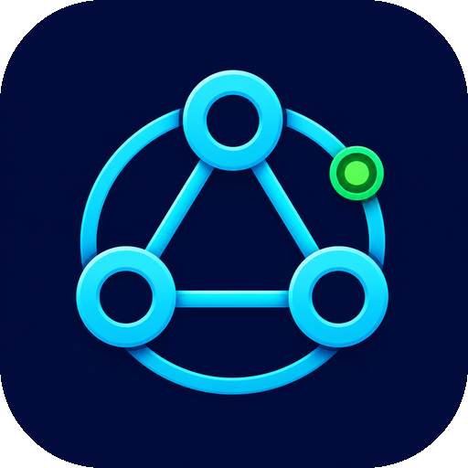
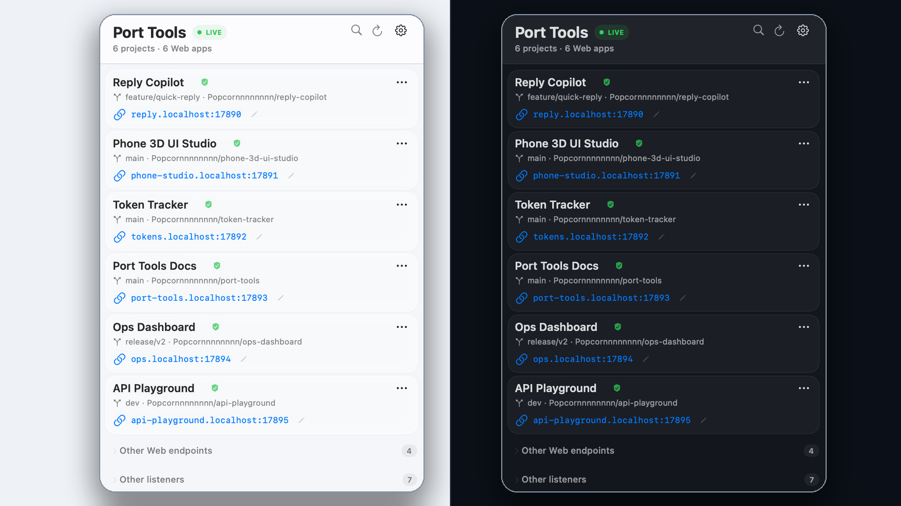

<div align="center">
  
  <h1>Port Tools</h1>
  <p><strong>把 localhost 端口还原成项目、应用和服务类型。</strong></p>
  <p>一个本地优先的 macOS 菜单栏工具，用来理解这台 Mac 上已经运行的开发服务。</p>
  <p><a href="README.md">English</a> · <strong>简体中文</strong></p>
  <p>macOS 14+ · 原生 SwiftUI · 自包含 Go 核心 · 仅在本机运行</p>
</div>

<p align="center">
  
</p>

## `lsof` 找到 PID，Port Tools 找到 PID 背后的项目

开发一天之后，`localhost:4178`、`localhost:4317` 和 `localhost:7680` 可能都能打开，但端口号不会告诉你它们分别属于哪个 repository、worktree 和 application。

Port Tools 扫描 Mac 上已经运行的监听端口，并尝试还原它们的开发上下文：

- repository、branch 和 Git worktree；
- 最近的 application manifest 和相对路径；
- 已验证的 Web 页面或 supporting service；
- 真正可以打开的本地地址；
- 是否能够在不猜测的情况下安全停止进程。

它把操作系统层面的端口表，变成一张项目层面的本地开发环境地图。

## 痛点和解决方式放在一起

| 遇到的问题 | Port Tools 的处理方式 |
| --- | --- |
| “`4178` 到底属于哪个项目？” | 沿进程父子关系和工作目录定位 repository、branch、worktree 与 application。 |
| “为什么一个仓库跑出了四个 `node`？” | 按项目和应用组织服务，并区分可见 Web 页面与 supporting service。 |
| “端口又变了。” | 为应用分配 `phone-studio.localhost:17890` 这样的稳定地址。 |
| “这个旧服务可以安全结束吗？” | 展示停止计划，重新验证进程身份，只发送 `SIGTERM`，并确认监听端口已经释放。 |

## 和常见工具有什么区别

Port Tools 不打算替代开发者已经信任的工具，而是连接它们之间缺少的项目上下文。

| 工具 | 最擅长解决 | Port Tools 补充的部分 |
| --- | --- | --- |
| [`lsof`](https://github.com/lsof-org/lsof) / `netstat` | socket、端口和 PID | repository、worktree、application、Web 类型和可直接访问的地址 |
| Activity Monitor | 查看进程及资源占用 | 只关注开发 Web 服务，并围绕项目而不是 PID 组织信息 |
| `kill-port` / [`fkill`](https://github.com/sindresorhus/fkill) | 快速释放端口 | 归属证据、拒绝规则、身份复核和端口释放确认 |
| [Portless](https://github.com/vercel-labs/portless) | 用稳定域名启动应用 | 发现并识别那些已经通过其他命令、IDE 或 Agent 启动的服务 |
| [Caddy](https://caddyserver.com/docs/caddyfile/directives/reverse_proxy) | 灵活的反向代理基础设施 | 自动维护本地服务清单，并建立具有项目语义的路由归属 |
| Docker Desktop | 容器及其发布端口 | 将宿主机进程、worktree、application 和保守的 Docker 处理放在同一个视图中 |

## 一条完整的本地工作流

1. **发现**已经运行的 HTTP/HTTPS 服务，不要求改变原来的启动方式。
2. **识别**进程、repository、worktree、application 和服务角色。
3. **命名**并持久化一个稳定的 `*.localhost` 地址。
4. **打开或复制**菜单栏中可以直接访问的地址。
5. **安全停止**经过审查和重新验证的目标。

## 技术原理

原生 SwiftUI 菜单栏界面通过私有、仅当前用户可访问的 Unix socket 与内置 Go 核心通信。Go 核心负责发现监听端口、检查进程树和工作目录、读取 Git 与 application manifest 证据、探测 HTTP/HTTPS 行为、原子化保存别名，并运行仅绑定 loopback 的反向代理。

安全停止刻意比 `kill -9` 更保守：Docker、其他用户、共享 runtime 和无法确认归属的目标会被拒绝。符合条件的目标会获得与进程身份绑定的计划令牌，在发送 `SIGTERM` 前再次进行完整验证；只有目标监听端口真正释放后，才会报告成功。目前没有实现强制停止。

## 构建当前 v1.0 候选版

构建需要 Go 和 Xcode Command Line Tools。生成的应用是自包含的，运行时不需要 Python、Node.js、npm、Homebrew、Docker 或独立代理。

```bash
git clone https://github.com/Popcornnnnnnnn/port-tools.git
cd port-tools
native/trial/build.sh
open "native/.build/Port Tools.app"
```

验证应用包和关键运行链路：

```bash
python3 native/trial/verify.py
```

## v1.0 边界

当前候选版刻意保持本地化和保守策略：

- macOS 14 或更高版本；
- IPv4/IPv6 loopback 上的非特权端口代理；
- 不修改 `/etc/hosts`，不安装本地受信任 CA，不占用 80/443；
- 没有特权 helper，也不会强制结束进程；
- 代码和自动测试不能代替真实的菜单栏交互验收。

## 工程资料

- [产品需求](docs/PRD-v0.1.md)
- [架构决策](docs/ADR-0001-production-architecture.md)
- [技术验证](docs/technical-spike.md)
- [打包要求](docs/packaging-requirements.md)

Port Tools v1.0 正在接近第一次公开发布，欢迎提交 Issue 或参与早期体验。
