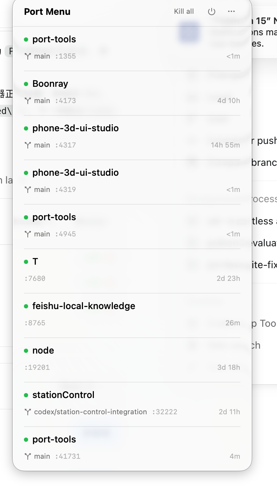

# Port Menu inventory UI audit — 2026-09-04

Audit mode: combined UX and screenshot-based accessibility review  
Scope: the open menu-bar inventory panel only  
User goal: recognize active development services and decide what to open or stop

## Step 1 — scan the inventory

Health: good foundation, with important safety and identity gaps.

### Strengths

- The screen leads with project names rather than process names or PIDs. This
  matches how a developer remembers work.
- Branch, port, and age fit into one quiet secondary row. The user can parse the
  entire list without opening a detail view.
- The green status dot, generous row height, and separators make a long list
  easy to scan.
- Multiple services from one repository remain visible individually. The two
  `phone-3d-ui-studio` and three `port-tools` rows make concurrent instances
  obvious instead of collapsing evidence.
- Process age is surprisingly valuable here: `4d 10h`, `3d 18h`, and `2d 11h`
  immediately surface likely cleanup candidates without claiming they are
  unused.

### UX risks

- Repeated project names are not grouped or disambiguated by package, worktree,
  page title, or purpose. The user still has to remember what ports 4317 and
  4319 mean.
- Rows named `T` and `node` show the fallback identity problem. They are
  technically discoverable but not actionable without cwd, command, page title,
  or a confidence explanation.
- All green dots imply the same kind of health. The screen does not distinguish
  “TCP is listening,” “HTTP responded,” “page is healthy,” or “route is
  reachable.”
- There is no visible bind exposure. A loopback service and a service listening
  on all interfaces would look equally safe.
- `Kill all` is visually prominent and, according to the inspected source,
  immediately sends SIGTERM to every listed process. That consequence is much
  larger than the calm label suggests.
- The power icon has no visible label. From the screenshot alone, it could mean
  quit the app, stop scanning, or stop all services.

### Accessibility risks visible in the screenshot

- Ports and ages use very light gray text on white. Contrast needs measurement;
  visually it may be too faint for low-vision users.
- Meaning relies partly on a green dot. A text/status label is needed so color
  is not the only health cue.
- Icon-only actions need accessible names, keyboard focus behavior, and adequate
  hit targets. Those cannot be verified from this screenshot.

## What `port-tools` should inherit

- Native menu-bar surface.
- Project name as the primary label.
- Branch, port, and age in one compact secondary line.
- Fast visual scanning and restrained decoration.
- One row per actual listener, even when several belong to the same project.

## What `port-tools` should add

- Group rows by project/worktree while preserving individual services inside
  the group.
- Use page title or package/app name to disambiguate sibling ports.
- Replace the single green dot with explicit states such as `Web verified`,
  `TCP only`, `Unreachable`, and `Exposed to LAN`.
- Make stable alias the primary URL when present, with raw port secondary.
- Move Stop behind a target preview and make Stop all a review flow, not a
  one-click command.
- Show the evidence behind `possibly forgotten`, with age as one signal rather
  than a verdict.

## Evidence limits

This audit uses one user-provided screenshot. It verifies the visible inventory
state, not hover actions, keyboard navigation, VoiceOver labels, click targets,
animations, settings, empty/error states, or the real behavior after Open/Kill.
